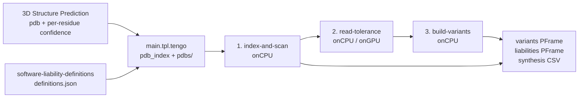

# Antibody Variant Designer

Ranked antibody variant hypotheses that remove chemical liabilities.

The block reads a predicted V-domain structure and its per-residue confidence
from the [3D Structure
Prediction](https://github.com/platforma-open/3d-structure-prediction) block,
rescans the liability motifs and solvent exposure in-block, triages which
liabilities are worth fixing, reads [AntiFold](https://doi.org/10.1093/bioadv/vbae202)
per-position matrices once per antibody, keeps only candidates that clear the
target liability without introducing a new one, and emits ranked variant
hypotheses — as a fixed-column CSV for synthesis and as a PFrame for its own UI.

Sister blocks: [Antibody Sequence
Liabilities](https://github.com/platforma-open/antibody-sequence-liabilities)
(sequence-only motif scan) and [3D Structure-Based
Liabilities](https://github.com/platforma-open/3D-Structure-Based-Liabilities)
(structure-filtered liability calls and developability cost). This block is the
first one that proposes a change rather than reporting a state.

Every emitted variant is an **unvalidated hypothesis**. The block predicts no
variant structure and estimates no binding strength.

## Pipeline

The workflow is **three steps over four execs** — one per step, plus one that
prints the shared liability taxonomy. Each step is its own Tengo template under
`workflow/src/steps/`, and `main.tpl.tengo` holds nothing but the wiring, so the
pipeline is readable without opening python.



The chain has no fan-out. Every step runs **once over the whole dataset** and
loops over the parent antibodies inside that one exec, so a failure keeps the
name of the antibody it happened to — a skip row keyed by clonotype, never a
failed job.

| Step | Entrypoint | Does | Resources |
|---|---|---|---|
| 1. `index-and-scan` | `scan.py` | builds the residue index from the ATOM records, computes solvent exposure, detects every liability motif, then triages each hit into `exposed` / `buried` / `fixability-declined` with an independent low-confidence flag | `onCPU` 2 cpu / 4 GiB |
| 2. `read-tolerance` | `antifold.py` | loads the AntiFold checkpoint once, then reads per-position log-probabilities and perplexity for every antibody that still has actionable work | `onCPU` or `onGPU` 4 cpu / 8 GiB / 6 GiB vram |
| 3. `build-variants` | `variants.py` | proposes substitutions at editable positions, **re-scans each candidate** and discards any that fails to clear its target or introduces a new liability, then ranks what survives | `onCPU` 2 cpu / 4 GiB |

## Data Flow

**Intermediates are plain files staged workdir to workdir.** No PColumn spec
exists for any of them and nothing imports them — only what the UI reads becomes
a PFrame. Each intermediate is one file per clonotype in a directory, named from
the PDB index, and a directory crosses an exec boundary as a `saveFileSet` capture
restaged with `addFiles`, never as a path.

| Artifact | Producer → consumer | Format | Read/write by |
|---|---|---|---|
| `pdb_index.tsv` | `main.tpl.tengo` → every step | `clonotypeKey ⇥ filename`, the full ResourceMap in sorted-key order | `pdb_index.py` |
| `definitions.json` | taxonomy exec → steps 1, 3 | the taxonomy package's document — `schemaVersion` / `liabilities` / `fixabilityWeights` | `taxonomy_store.py` |
| `per_residue_confidence.tsv` | `main.tpl.tengo` → step 1 | clonotype key + JSON records, zero or one per run | `--per-residue-confidence` |
| `clonotype_filter.tsv` | `main.tpl.tengo` → step 1 | the optional Lead Selection subset, zero or one per run | `--clonotype-filter` |
| `residues/<stem>.json` | step 1 → steps 2, 3 | the residue index, written only when the index phase passed | `residue_store.py` |
| `triaged/<stem>.json` | step 1 → steps 2, 3 | the actionable liabilities, written only when at least one is actionable; step 2 reads it purely as a gate | `liability_store.py` |
| `tolerance/<stem>.tsv` | step 2 → step 3 | `chain ⇥ posins ⇥ perplexity ⇥ 20 log-probability columns` | `tolerance_store.py` |
| `skip.tsv` | every step → `outputs` | `clonotypeKey ⇥ reason`, one per step so three per run | `skip_store.py` (write), the model (reduce) |

## Layout

| Path | What it holds |
|---|---|
| `workflow/` | Tengo templates — orchestration, exec, p-frame assembly |
| `model/` | `BlockModelV3` — block data, args projection, outputs for the UI |
| `ui/` | Vue 3 + `@platforma-sdk/ui-vue` — the variant table and the settings panel |
| `software/` | the python package doing the per-residue work |
| `block/` | the published block facade (`block.components`, `block.meta`) |
| `test/` | integration tests |

## Development

```bash
pnpm install
pnpm run build:dev-local     # requires a running docker daemon
pnpm run check
pnpm run test                # requires a backend on PL_ADDRESS
pnpm run upgrade-sdk         # refresh the canonical structure + SDK catalog
```
